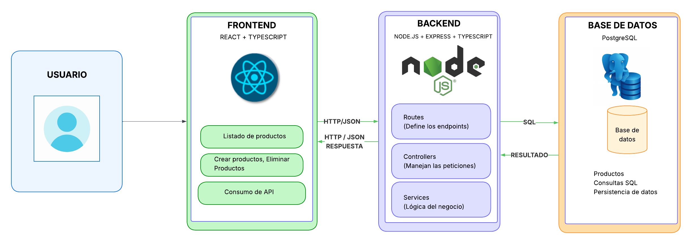

## Diagrama de Arquitectura General




Este diagrama muestra la arquitectura general de la aplicacion para administrar el catalogo de productos de DISAGRO.

La aplicacion se divide en tres partes principales:

- Frontend
- Backend
- Base de datos

El flujo principal es el siguiente:

```txt
Usuario -> Frontend -> Backend -> Base de datos
```

## Usuario

El usuario es la persona que va a utilizar la aplicacion web.

Desde la pantalla principal podra consultar el listado de productos, crear productos nuevos y eliminar productos que ya no se comercialicen.

## Frontend

El frontend es la parte visual de la aplicacion, es decir, lo que el usuario ve y utiliza en el navegador.

Para esta parte se utilizara:

```txt
React + TypeScript
```

El frontend tendra una pantalla para mostrar el listado de productos y un formulario para crear nuevos productos.

Tambien tendra opciones para eliminar productos del catalogo.

El frontend no se conecta directamente a la base de datos. En su lugar, se comunica con el backend por medio de peticiones HTTP enviando y recibiendo informacion en formato JSON.

Ejemplos de peticiones:

```txt
GET /listado
GET /producto
POST /crear
PUT /modificar
DELETE /eliminar
```

## Backend

El backend es la parte encargada de recibir las peticiones del frontend, procesarlas y comunicarse con la base de datos.

Para esta parte se utilizara:

```txt
Node.js + Express + TypeScript
```

El backend estara organizado en tres capas principales:

### Routes

Las rutas definen los endpoints de la API.

Por ejemplo:

```txt
POST /crear
PUT /modificar
DELETE /eliminar
GET /producto
GET /listado
```

Estas rutas indican que acciones puede realizar el frontend.

### Controllers

Los controladores reciben las peticiones que llegan a cada ruta.

Su responsabilidad es tomar los datos enviados por el frontend, llamar a la logica correspondiente y devolver una respuesta.

Por ejemplo, si el usuario quiere crear un producto, el controlador recibe los datos del producto y llama al servicio encargado de guardarlo.

### Services

Los servicios contienen la logica principal de la aplicacion.

En esta capa se manejan acciones como:

- Crear un producto
- Modificar un producto
- Eliminar un producto
- Buscar un producto
- Listar todos los productos

Separar la logica en servicios ayuda a que el backend sea mas ordenado y facil de mantener.

## Base de datos

La base de datos es donde se guarda la informacion de los productos.

Para esta prueba se propone utilizar:

```txt
PostgreSQL
```

Cada producto debe tener las siguientes propiedades:

```txt
Codigo
Nombre
Descripcion
Precio
Categorias
```

La base de datos permite que la informacion quede almacenada de forma centralizada y no dependa de hojas de calculo manuales.

## Flujo para listar productos

El flujo para mostrar productos en pantalla seria:

```txt
1. El usuario entra a la pagina de productos.
2. El frontend solicita la informacion al backend usando GET /listado.
3. El backend recibe la peticion.
4. El backend consulta los productos en PostgreSQL.
5. PostgreSQL devuelve los datos encontrados.
6. El backend responde al frontend en formato JSON.
7. El frontend muestra el listado de productos en pantalla.
```

## Flujo para crear un producto

El flujo para crear un producto seria:

```txt
1. El usuario llena el formulario de producto.
2. El frontend envia los datos al backend usando POST /crear.
3. El backend recibe y procesa la informacion.
4. El backend guarda el producto en PostgreSQL.
5. La base de datos confirma que el producto fue guardado.
6. El backend responde al frontend.
7. El frontend actualiza el listado de productos.
```

## Flujo para eliminar un producto

El flujo para eliminar un producto seria:

```txt
1. El usuario selecciona un producto para eliminar.
2. El frontend envia la solicitud al backend usando DELETE /eliminar.
3. El backend recibe la solicitud.
4. El backend elimina el producto en PostgreSQL.
5. La base de datos confirma la eliminacion.
6. El backend responde al frontend.
7. El frontend actualiza el listado de productos.
```
