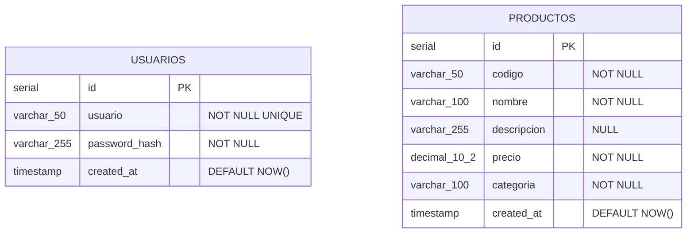

# Diagrama Entidad-Relacion (ER)

Representa las tablas de la base de datos `gestorinventario`, sus campos, tipos y la relacion entre ellas.

---

## Diagrama



Las tablas no tienen relacion directa entre si en la base de datos. `usuarios` gestiona el acceso al sistema y `productos` almacena el catalogo. La conexion entre ambas ocurre a nivel de aplicacion: el backend verifica la sesion del usuario antes de permitir operaciones sobre productos.

---

## Descripcion de tablas

### `usuarios`

Almacena las credenciales de acceso al sistema.

| Campo          | Tipo           | Restriccion      | Descripcion                              |
|----------------|----------------|------------------|------------------------------------------|
| id             | SERIAL         | PK               | Identificador unico autoincremental      |
| usuario        | VARCHAR(50)    | NOT NULL, UNIQUE | Nombre de usuario (no se puede repetir)  |
| password_hash  | VARCHAR(255)   | NOT NULL         | Contrasena hasheada con bcrypt           |
| created_at     | TIMESTAMP      | DEFAULT NOW()    | Fecha de creacion del registro           |

### `productos`

Almacena el catalogo de productos del inventario.

| Campo       | Tipo           | Restriccion      | Descripcion                           |
|-------------|----------------|------------------|---------------------------------------|
| id          | SERIAL         | PK               | Identificador unico autoincremental   |
| codigo      | VARCHAR(50)    | NOT NULL         | Codigo interno del producto           |
| nombre      | VARCHAR(100)   | NOT NULL         | Nombre descriptivo del producto       |
| descripcion | VARCHAR(255)   | NULL             | Descripcion opcional del producto     |
| precio      | DECIMAL(10,2)  | NOT NULL         | Precio con hasta 2 decimales          |
| categoria   | VARCHAR(100)   | NOT NULL         | Categoria a la que pertenece          |
| created_at  | TIMESTAMP      | DEFAULT NOW()    | Fecha en que se registro el producto  |

---

## Script SQL completo

```sql
CREATE TABLE productos (
    id          SERIAL PRIMARY KEY,
    codigo      VARCHAR(50)    NOT NULL,
    nombre      VARCHAR(100)   NOT NULL,
    descripcion VARCHAR(255),
    precio      DECIMAL(10,2)  NOT NULL,
    categoria   VARCHAR(100)   NOT NULL,
    created_at  TIMESTAMP      DEFAULT NOW()
);

CREATE TABLE usuarios (
    id            SERIAL PRIMARY KEY,
    usuario       VARCHAR(50)    NOT NULL UNIQUE,
    password_hash VARCHAR(255)   NOT NULL,
    created_at    TIMESTAMP      DEFAULT NOW()
);
```
