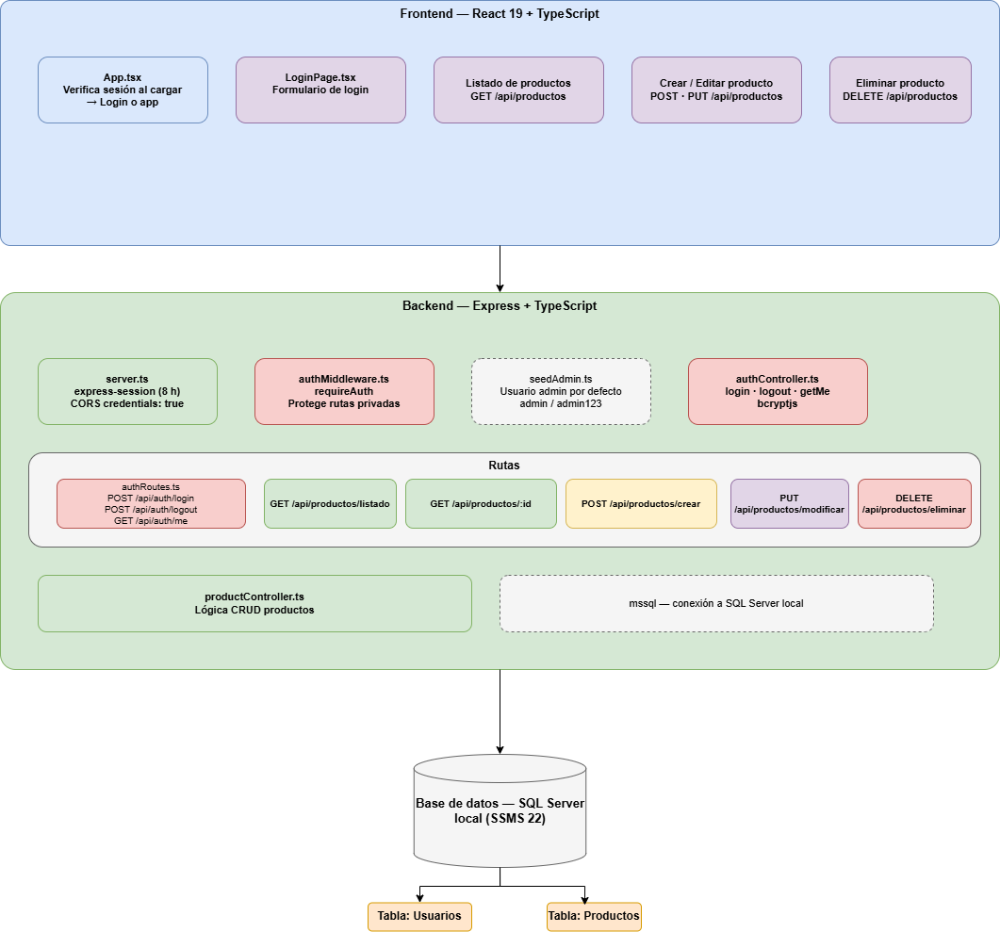

## Diagrama de Arquitectura General

Este diagrama muestra la arquitectura general de la aplicacion para administrar catalogo de productos.

La aplicacion se divide en tres partes principales:

- Frontend
- Backend
- Base de datos

El flujo principal es el siguiente:



---

## Usuario

El usuario es la persona que va a utilizar la aplicacion web desde el navegador.

Antes de poder usar la aplicacion debe iniciar sesion con su usuario y contrasena. Una vez autenticado puede:

- Consultar el listado de productos
- Crear productos nuevos
- Editar productos existentes
- Eliminar productos del catalogo
- Cerrar sesion

---

## Frontend

El frontend es la parte visual de la aplicacion, lo que el usuario ve y utiliza en el navegador.

**Tecnologias utilizadas:**

```txt
React 19 + TypeScript + Vite
```

### Estructura de páginas y componentes

```txt
App.tsx
├── LoginPage.tsx          (se muestra si no hay sesion activa)
└── ProductsPage.tsx       (se muestra si hay sesion activa)
    ├── ProductForm.tsx    (formulario para crear o editar un producto)
    └── ProductTable.tsx   (tabla con el listado de productos)
```

### Servicios (comunicacion con el backend)

```txt
axiosInstance.ts     configuracion de axios con cookies habilitadas
authService.ts       login, logout, verificacion de sesion
productService.ts    CRUD de productos
```

El frontend se comunica con el backend por medio de peticiones HTTP enviando y recibiendo informacion en formato JSON. Todas las peticiones incluyen la cookie de sesion gracias a `withCredentials: true` en axios.

### Endpoints que consume el frontend

```txt
POST   /api/auth/login       inicia sesion
POST   /api/auth/logout      cierra sesion
GET    /api/auth/me          verifica si hay sesion activa

GET    /api/productos         lista todos los productos
GET    /api/productos/:id     obtiene un producto por id
POST   /api/productos         crea un producto nuevo
PUT    /api/productos/:id     actualiza un producto existente
DELETE /api/productos/:id     elimina un producto
```

---

## Backend

El backend es la parte encargada de recibir las peticiones del frontend, procesarlas y comunicarse con la base de datos.

**Tecnologias utilizadas:**

```txt
Node.js + Express 5 + TypeScript
express-session  (manejo de sesiones)
bcryptjs         (hashing de contraseñas)
pg               (conector para PostgreSQL)
```

El backend esta organizado en cuatro capas:

### Routes (Rutas)

Las rutas definen los endpoints disponibles de la API y las conectan con sus controladores.

```txt
authRoutes.ts       rutas publicas de autenticacion (/api/auth)
productRoutes.ts    rutas protegidas de productos   (/api/productos)
```

### Middleware

El middleware se ejecuta entre que llega la peticion y llega al controlador.

```txt
requireAuth     verifica que haya sesion activa antes de permitir acceso
                a las rutas de productos; si no hay sesion responde 401
```

Las rutas de autenticacion (`/api/auth`) son publicas y no pasan por `requireAuth`.
Las rutas de productos (`/api/productos`) si pasan por `requireAuth`.

### Controllers (Controladores)

Los controladores reciben las peticiones, validan los datos, ejecutan la consulta SQL y devuelven la respuesta.

```txt
authController.ts      login, logout, getMe
productController.ts   getProductos, getProductoById, createProducto,
                       updateProducto, deleteProducto
```

Todos los controladores usan consultas parametrizadas con `$1`, `$2`, `$3`... para evitar SQL Injection.

### Database

```txt
db.ts    abre y exporta la conexion con PostgreSQL mediante un Pool
         la configuracion viene del archivo .env
```

---

## Base de datos

La base de datos almacena los productos y los usuarios del sistema.

**Motor utilizado:**

```txt
PostgreSQL
Servidor: localhost
BD:       gestorinventario
```

### Tabla `productos`

```sql
CREATE TABLE productos (
    id          SERIAL PRIMARY KEY,
    codigo      VARCHAR(50)    NOT NULL,
    nombre      VARCHAR(100)   NOT NULL,
    descripcion VARCHAR(255),
    precio      DECIMAL(10,2)  NOT NULL,
    categoria   VARCHAR(100)   NOT NULL,
    created_at  TIMESTAMP      DEFAULT NOW()
);
```

### Tabla `usuarios`

```sql
CREATE TABLE usuarios (
    id            SERIAL PRIMARY KEY,
    usuario       VARCHAR(50)    NOT NULL UNIQUE,
    password_hash VARCHAR(255)   NOT NULL,
    created_at    TIMESTAMP      DEFAULT NOW()
);
```


---

## Flujo de autenticacion (login)

```txt
1. El usuario ingresa su usuario y contrasena en LoginPage.
2. El frontend envia POST /api/auth/login con las credenciales.
3. El backend busca el usuario en la tabla usuarios.
4. bcrypt compara la contrasena ingresada con el hash guardado.
5. Si coinciden, el backend guarda userId y usuario en la sesion del servidor.
6. El servidor envia una cookie (connect.sid) al navegador.
7. El frontend recibe el nombre de usuario y muestra la app.
```

## Flujo de verificacion de sesion (al recargar la pagina)

```txt
1. El frontend carga y llama a GET /api/auth/me.
2. El navegador envia automaticamente la cookie de sesion.
3. El backend verifica que la cookie corresponda a una sesion valida.
4. Si es valida, responde con el nombre de usuario.
5. El frontend muestra la app directamente sin pedir login.
6. Si no es valida, responde 401 y el frontend muestra el login.
```

## Flujo para listar productos

```txt
1. El usuario entra a la pagina de productos (ya autenticado).
2. El frontend envia GET /api/productos con la cookie de sesion.
3. requireAuth verifica que la sesion sea valida.
4. productController consulta SELECT * FROM productos en PostgreSQL.
5. PostgreSQL devuelve el array de productos en result.rows.
6. El backend responde al frontend en formato JSON.
7. El frontend muestra el listado en ProductTable.
```

## Flujo para crear un producto

```txt
1. El usuario llena el formulario en ProductForm y hace submit.
2. El frontend envia POST /api/productos con los datos en el body.
3. requireAuth verifica la sesion.
4. productController valida que los campos obligatorios esten presentes.
5. Se ejecuta INSERT INTO productos con los datos parametrizados ($1, $2...).
6. PostgreSQL confirma la insercion.
7. El backend responde con HTTP 201 (Created).
8. El frontend limpia el formulario y recarga el listado.
```

## Flujo para editar un producto

```txt
1. El usuario hace click en "Editar" en la tabla.
2. El frontend carga los datos del producto en ProductForm.
3. El usuario modifica los campos y hace submit.
4. El frontend envia PUT /api/productos/:id con los datos actualizados.
5. requireAuth verifica la sesion.
6. productController ejecuta UPDATE productos WHERE id = $6.
7. El backend responde con HTTP 200.
8. El frontend recarga el listado.
```

## Flujo para eliminar un producto

```txt
1. El usuario hace click en "Eliminar" en la tabla.
2. El frontend muestra una confirmacion con window.confirm().
3. Si el usuario confirma, el frontend envia DELETE /api/productos/:id.
4. requireAuth verifica la sesion.
5. productController ejecuta DELETE FROM productos WHERE id = $1.
6. El backend responde con HTTP 200.
7. El frontend recarga el listado.
```

## Flujo de cierre de sesion (logout)

```txt
1. El usuario hace click en "Cerrar sesion" en la navbar.
2. El frontend envia POST /api/auth/logout.
3. El backend destruye la sesion en el servidor.
4. El backend borra la cookie connect.sid del navegador.
5. El frontend limpia el estado local y muestra el login.
```
