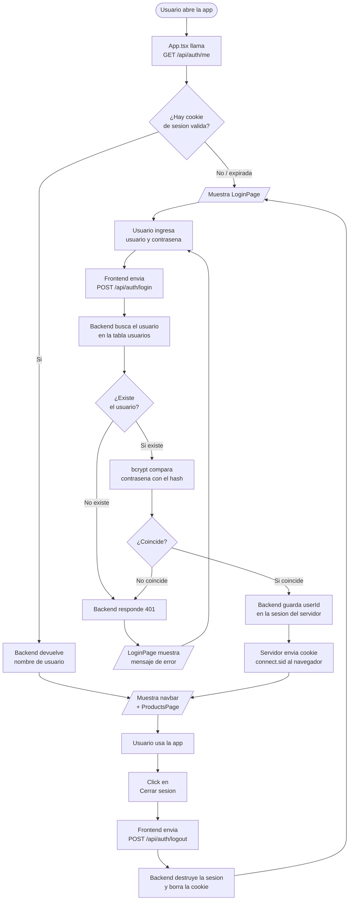
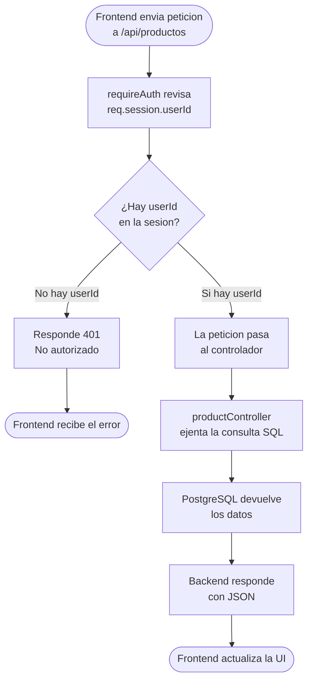
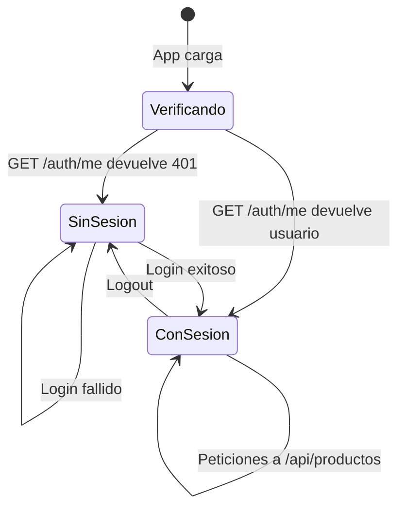

# Diagrama de Flujo - Autenticacion

Este diagrama muestra paso a paso como funciona el proceso de login, verificacion de sesion y logout en la aplicacion.

---

## Flujo completo de autenticacion

---

## Flujo de una peticion protegida

Cada vez que el frontend pide datos de productos, la peticion pasa primero por el middleware `requireAuth`.

---

## Estados posibles de la sesion

