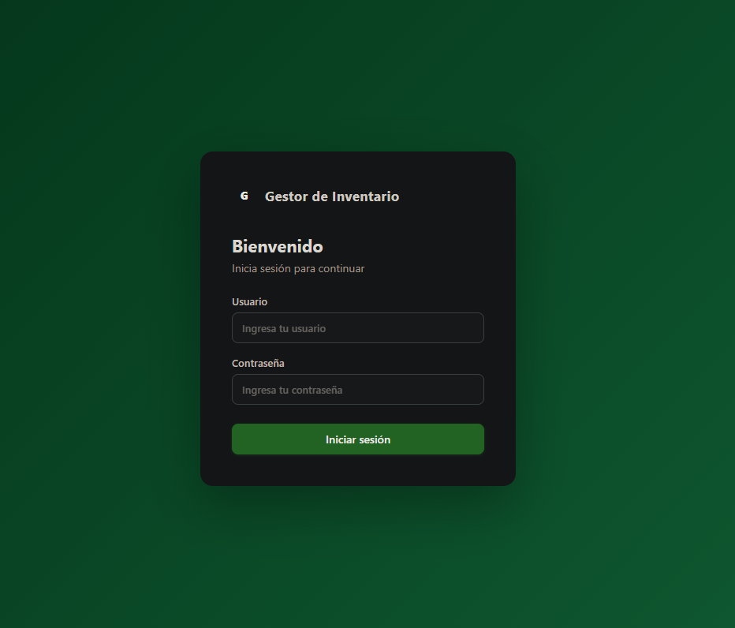
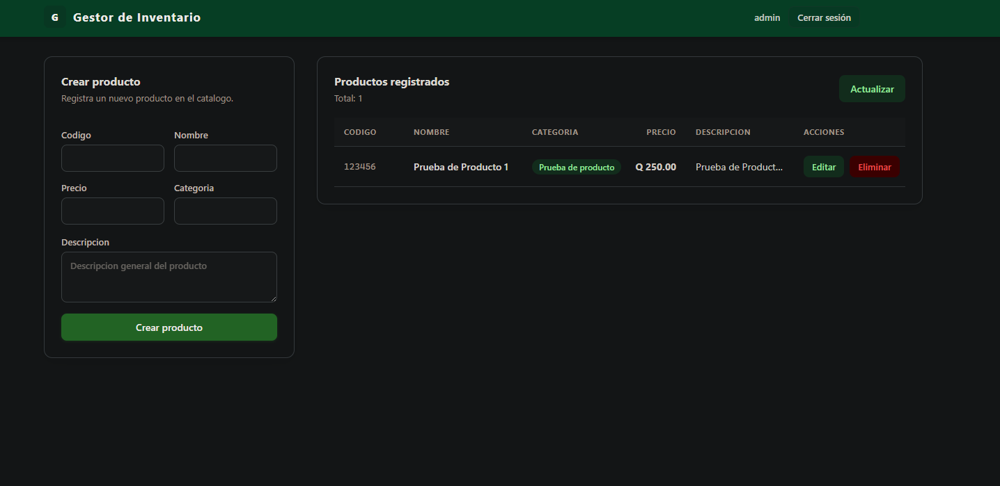
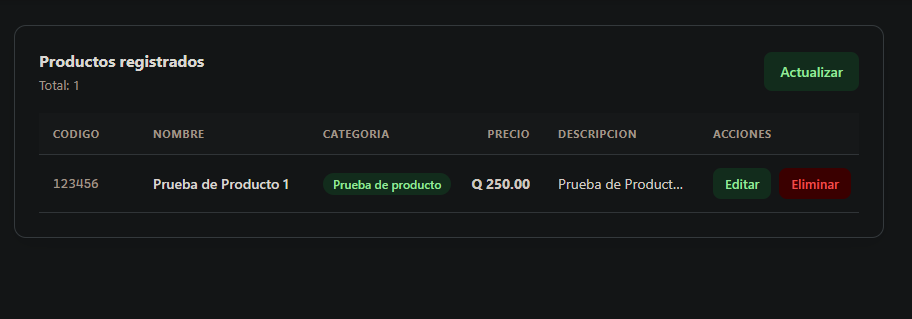
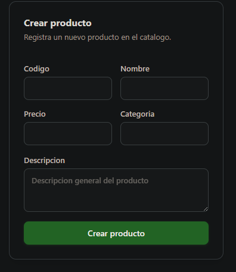
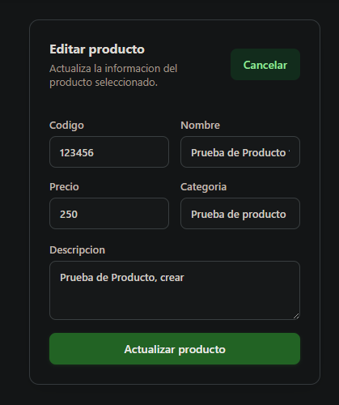
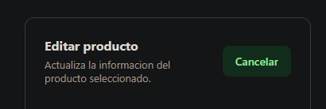
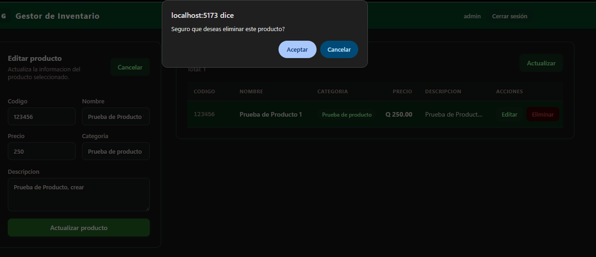
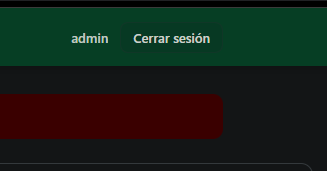

# Manual de Usuario
## Gestor de Inventario

---

## Introduccion

El Gestor de Inventario es una aplicacion web que permite administrar el catalogo de productos.

Desde la aplicacion usted puede:

- Ver el listado completo de productos registrados
- Agregar productos nuevos al catalogo
- Editar la informacion de un producto existente
- Eliminar productos del catalogo
- Cerrar sesion cuando termine de trabajar

---

## Requisitos para usar la aplicacion

Para poder usar la aplicacion solo necesita:

- Una computadora con acceso a internet o a la red local
- Un navegador web (Google Chrome, Firefox, Edge o similar)
- Un usuario y contrasena proporcionados por el administrador del sistema

---

## 1. Iniciar sesion

Al abrir la aplicacion vera la pantalla de inicio de sesion.

**Pasos:**

1. Escriba su nombre de usuario en el campo **Usuario**
2. Escriba su contrasena en el campo **Contrasena**
3. Haga clic en el boton **Iniciar sesion**

Si las credenciales son correctas, la aplicacion lo llevara directamente a la pantalla principal.

### Errores comunes al iniciar sesion

| Mensaje                              | Causa                                          |
|--------------------------------------|------------------------------------------------|
| Usuario o contrasena incorrectos     | El usuario no existe o la contrasena es erronea |
| No se pudo conectar al servidor      | El servidor no esta disponible en ese momento  |

---

## 2. Pantalla principal

Una vez que inicia sesion vera la pantalla principal de la aplicacion.

La pantalla tiene dos secciones:

- **Formulario (izquierda):** donde se crean o editan productos
- **Tabla de productos (derecha):** donde se ve el listado completo

En la barra superior puede ver su nombre de usuario y el boton para cerrar sesion.

---

## 3. Ver el listado de productos

El listado de productos se carga automaticamente cuando entra a la aplicacion.

La tabla muestra la siguiente informacion por cada producto:

Si no hay productos registrados, la tabla mostrara el mensaje:
**"No hay productos registrados"**

### Actualizar el listado

Si necesita refrescar la lista de productos, haga clic en el boton **Actualizar** que esta en la parte superior derecha de la tabla.

---

## 4. Crear un producto nuevo

Para agregar un producto al catalogo:

2. Haga clic en el boton **Crear producto**

3. Si el producto se guardo correctamente, aparecera el mensaje:
   **"Producto creado correctamente"**

4. El formulario se limpiara automaticamente y el nuevo producto aparecera en la tabla

---

## 5. Editar un producto

Para modificar la informacion de un producto existente:

1. Ubique el producto en la tabla
2. Haga clic en el boton **Editar** de ese producto
3. El formulario de la izquierda se llenara con los datos actuales del producto y el titulo cambiara a **"Editar producto"**
4. Modifique los campos que desea cambiar
5. Haga clic en el boton **Actualizar producto**
6. Si se guardo correctamente, aparecera el mensaje:
   **"Producto actualizado correctamente"**

### Cancelar una edicion

Si empezo a editar un producto pero no desea guardar los cambios, haga clic en el boton **Cancelar** que aparece en la parte superior del formulario. El formulario volvera a su estado original para crear un producto nuevo.

---

## 6. Eliminar un producto

Para eliminar un producto del catalogo:

1. Ubique el producto en la tabla
2. Haga clic en el boton **Eliminar** de ese producto
3. Aparecera una ventana de confirmacion preguntando:
   **"Seguro que deseas eliminar este producto?"**
4. Haga clic en **Aceptar** para confirmar la eliminacion
5. Si se elimino correctamente, aparecera el mensaje:
   **"Producto eliminado correctamente"**

---

## 7. Cerrar sesion

Cuando termine de trabajar, cierre su sesion para proteger el acceso a la aplicacion.

1. Haga clic en el boton **Cerrar sesion** que esta en la barra superior derecha
2. La aplicacion lo regresara a la pantalla de inicio de sesion

---

## Mensajes de la aplicacion

Durante el uso de la aplicacion pueden aparecer los siguientes mensajes:

| Mensaje                             | Tipo   | Significado                                |
|-------------------------------------|--------|--------------------------------------------|
| Producto creado correctamente       | Exito  | El producto se guardo en el sistema        |
| Producto actualizado correctamente  | Exito  | Los cambios se guardaron correctamente     |
| Producto eliminado correctamente    | Exito  | El producto fue eliminado del catalogo     |
| No se pudo guardar el producto      | Error  | Hubo un problema al guardar, intente de nuevo |
| No se pudo eliminar el producto     | Error  | Hubo un problema al eliminar, intente de nuevo |
| No se pudieron cargar los productos | Error  | Hubo un problema de conexion con el servidor |
